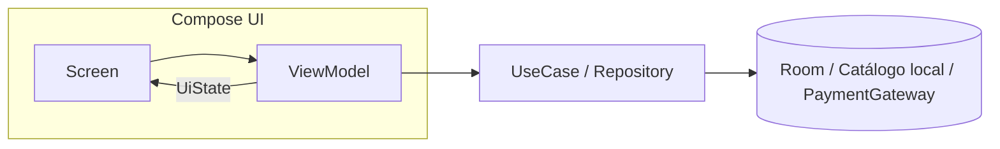
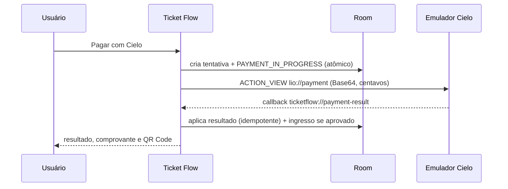

# Ticket Flow

Aplicativo Android de **venda presencial de ingressos** para eventos locais, com
pagamento pela **Cielo Smart** (integração local via Deep Link), prevenção de cobrança
duplicada, persistência local, comprovante e **ingresso com QR Code**.

Case técnico para vaga Android. Kotlin + Jetpack Compose, sem backend.

---

## Requisitos

- **Android Studio** (Ladybug ou mais recente) ou apenas o Android SDK + Gradle Wrapper.
- **JDK 17** (a toolchain do projeto é fixada em 17).
- **Android SDK 36** instalado (`compileSdk`/`targetSdk = 36`; `minSdk = 24`).
- Um **AVD Android 10 (API 29)** para validação manual, com o **Emulador Cielo** instalado.

## Configuração

1. Copie o exemplo de propriedades locais e ajuste o caminho do SDK:

   ```bash
   cp local.properties.example local.properties
   ```

   Edite `sdk.dir` apontando para o seu Android SDK. As chaves da Cielo podem ficar
   **vazias** — o Emulador Cielo aceita credenciais placeholder e o app trata a ausência
   de forma explícita. Nenhum segredo é versionado.

   ```properties
   sdk.dir=/caminho/para/Android/sdk
   CIELO_CLIENT_ID=
   CIELO_ACCESS_TOKEN=
   ```

2. **Instale o Emulador Cielo** no AVD Android 10. Baixe o `lio-emulator.apk` conforme a
   [documentação oficial](https://docs.cielo.com.br/cielo-smart/docs/baixando-o-emulador-cielo)
   e instale:

   ```bash
   adb install -r lio-emulator.apk
   ```

## Build e testes

```bash
# Testes unitários + lint + APK debug (o mesmo que a CI roda)
./gradlew testDebugUnitTest lintDebug assembleDebug

# Instalar no AVD Android 10
adb install -r app/build/outputs/apk/debug/app-debug.apk

# Testes instrumentados (exigem AVD Android 10 conectado)
./gradlew connectedDebugAndroidTest
```

> Os testes **unitários** cobrem a lógica crítica (máquina de estados, gate de pagamento,
> callback, QR, ViewModels) e rodam sem dispositivo. Os testes **instrumentados** (Room,
> telas Compose e a jornada ponta a ponta com gateway fake) exigem o AVD.

## Fluxo de demonstração

1. **Eventos** → escolher um evento no catálogo.
2. **Checkout** → ajustar a quantidade; o total em centavos é recalculado.
3. **Pagar com Cielo** → o app persiste a tentativa e abre o Emulador Cielo.
4. No emulador, escolher **Sucesso**, **Cancelado** ou **Erro**.
5. **Resultado** → estado explícito; negado/cancelado/falha oferecem *Tentar novamente*.
6. **Aprovado** → comprovante e **ingresso com QR Code**.
7. **Ingressos** → histórico persistente; reabrir após fechar o app comprova a persistência.

Para demonstrar anti-duplicidade: toque várias vezes em *Pagar com Cielo*, ou retorne o
mesmo callback duas vezes — não há segunda cobrança, segunda aprovação nem segundo ingresso.

---

## Arquitetura

App **monomódulo** (`:app`) organizado por feature, com fluxo unidirecional de dados.



- **Features:** `events`, `checkout`, `purchase`, `ticket`.
- **Núcleos:** `model`, `database` (Room), `payment` (contrato + Cielo), `navigation`,
  `designsystem`, `di` (Hilt).
- Casos de uso só para regra de negócio real (ex.: `StartPaymentUseCase`,
  `HandleCieloCallbackUseCase`). Leitura simples não recebe camada artificial.
- Dependências externas atrás de interfaces (`PaymentGateway`, `EventRepository`,
  `PurchaseRepository`, `QrCodeEncoder`) — trocáveis por fakes nos testes.

Detalhes de design e decisões:
- Spec: [`docs/superpowers/specs/2026-08-13-ticket-flow-design.md`](docs/superpowers/specs/2026-08-13-ticket-flow-design.md)
- ADRs: [`docs/adr/`](docs/adr/)
- Spike da Cielo: [`docs/spikes/cielo-deep-link-android10.md`](docs/spikes/cielo-deep-link-android10.md)
- Uso de IA: [`docs/ai/usage-log.md`](docs/ai/usage-log.md)

### Fluxo de pagamento



### Máquina de estados

```
DRAFT ──► PAYMENT_IN_PROGRESS ──► APPROVED (terminal, gera ingresso 1x)
                               ├─► DENIED    ┐
                               ├─► CANCELLED ├─ pagáveis de novo (retry explícito)
                               ├─► FAILED    ┘
                               └─► PENDING   (interrompido; sem retry automático)
```

## Bibliotecas e justificativas

| Biblioteca | Por quê |
|-----------|---------|
| **Jetpack Compose + Material 3** | UI declarativa, unidirecional, exigida pelo escopo. |
| **Navigation Compose** | Navegação tipada por rota entre as telas. |
| **ViewModel + Coroutines/Flow** | Estado reativo com `StateFlow`, fora do ciclo de vida da UI. |
| **Room** | Fonte de verdade local com transações atômicas — base da idempotência. |
| **Hilt** | Injeção de dependência; permite trocar o gateway por fake nos testes. |
| **Kotlin Serialization** | Monta o JSON do request Cielo e faz parse defensivo do callback. |
| **ZXing (core)** | Geração local do QR Code do ingresso, sem serviço externo. |
| **JUnit4 + Turbine + MockK** | Testes de ViewModels, use cases e fluxos de estado. |
| **kotlinx-coroutines-test** | Controle determinístico de dispatcher nos testes. |
| **Hilt Testing + Compose UI Test** | Jornada instrumentada ponta a ponta com gateway fake. |

Versões centralizadas em [`gradle/libs.versions.toml`](gradle/libs.versions.toml).

## Como foi feita a integração com a Cielo Smart

Integração **local via Deep Link**, recomendada para o emulador e independente de backend
(ver [ADR 0001](docs/adr/0001-cielo-deep-link.md)):

1. Persiste a compra (`DRAFT`) e, atomicamente, cria a tentativa marcando
   `PAYMENT_IN_PROGRESS` — **só então** a Cielo é aberta.
2. Monta o JSON (credenciais configuráveis, referência, itens, **valor em centavos**),
   codifica em Base64 e monta `lio://payment?request=...&urlCallback=ticketflow://payment-result`.
3. Confirma que existe app capaz de resolver o Deep Link (`resolveActivity`); senão,
   retorna `HandlerUnavailable` e libera retry.
4. Inicia um **foreground service** e abre a Cielo por `ACTION_VIEW`.
5. Recebe o callback numa activity dedicada, **valida defensivamente** (scheme, host,
   Base64 MIME, estrutura), normaliza para o domínio e persiste de forma idempotente.

O contrato real foi observado num spike e registrado antes de expandir o app. Nenhum
token, dado de cartão ou payload bruto é logado ou persistido.

## Idempotência e tratamento de erros

- Gate atômico no banco + guarda de UI: dois toques não criam duas cobranças.
- Callback duplicado → `AlreadyApplied`; resultado divergente para tentativa terminal →
  `ConflictIgnored` (só diagnóstico).
- Ingresso criado uma única vez (`INSERT OR IGNORE`) na transação da aprovação.
- Processo interrompido → `PENDING` conservador no start; sem reenvio automático.
- Erros categorizados: handler indisponível, configuração ausente, request inválido,
  negado, cancelado, falha, callback ausente/malformado, falha de persistência.

## Testes

- **Unitários:** modelo/dinheiro, máquina de estados, `StartPaymentUseCase` (gate),
  `HandleCieloCallbackUseCase` (idempotência/correlação), recuperação de pendentes,
  parser/factory da Cielo, QR (matriz decodificável) e ViewModels.
- **Instrumentados:** DAO/transações do Room, telas Compose e a **jornada ponta a ponta**
  (`PurchaseJourneyTest`) com `FakePaymentGateway` — evento → aprovado → QR, e
  negado → retry → aprovado.

## Trade-offs considerados

- **Catálogo local em vez de backend** — concentra o esforço na engenharia Android (o case
  não avalia backend).
- **Monomódulo por feature** em vez de multimódulo — proporcional ao escopo e ao prazo.
- **QR local sem validação remota** — demonstra emissão e vínculo; não combate fraude sozinho.
- **`PENDING` conservador** — prioriza não cobrar em dobro quando o resultado é ambíguo.

## O que eu faria com mais tempo

- Backend para catálogo, estoque, reserva, **reconciliação** e validação de ingressos.
- Reconciliar tentativas `PENDING` consultando a Cielo por referência.
- Assinar o payload do QR e criar um app/processo de leitura na entrada.
- Extrair módulos de feature quando houver equipes e ciclos de release independentes.
- Observabilidade/analytics e testes de processo interrompido em dispositivos físicos.
- Ampliar acessibilidade, internacionalização e testes de screenshot.
